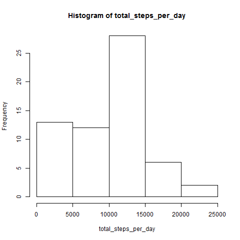
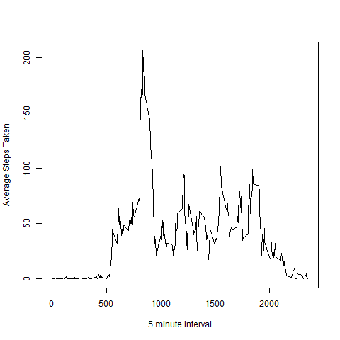
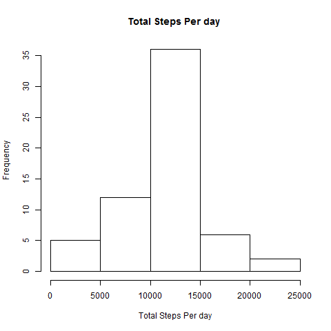

# Reproducible Research: Peer Assessment 1

##  Loading and preprocessing the data


```r
mydf <- read.csv("activity.csv", stringsAsFactors = FALSE)
mydf$date <- as.Date(mydf$date,format = "%Y-%m-%d")
```

## What is the mean total number of steps taken per day?

### Total Number of Steps per Day

```r
step_split <- split(mydf$steps,mydf$date)

total_steps_per_day <- sapply(step_split,sum,na.rm=TRUE)

hist(total_steps_per_day)
```

<!-- -->


### Mean

```r
mean_steps_per_day <- mean(total_steps_per_day, na.rm = TRUE)
mean_steps_per_day
```

```
## [1] 9354.23
```

## [1] 9354.23

### Median

```r
median_steps_per_day <- median(total_steps_per_day, na.rm = TRUE)
median_steps_per_day
```

```
## [1] 10395
```
## [1] 10395


## What is average daily activity pattern?
### Time Series Plot

```r
step_interval_split <- split(mydf$steps,unique(mydf$interval))
average_step_interval <- sapply(step_interval_split, mean, na.rm=TRUE)
plot(unique(mydf$interval), average_step_interval, type="l", xlab = "5 minute interval", ylab = "Average Steps Taken")
```

<!-- -->


### Maximum number of Steps in Interval

```r
max_step <- max(average_step_interval, na.rm = TRUE)
max_step_in_interval <- unique(mydf$interval)[as.numeric(which(average_step_interval==max_step))]
max_step_in_interval
```

```
## [1] 835
```
## [1] 835


## Imputing missing values

### Missing Values

```r
missing_values <- is.na(mydf$steps)
sum(missing_values)
```

```
## [1] 2304
```
## [1] 2304

### Filling missing values with mean of that intveral accross all days and plotting histogram


```r
newdf <- mydf
newdf$steps[missing_values] <- mean(newdf$steps,na.rm = TRUE)
```

### Histogram of New Dataset

```r
new_step_split <- split(newdf$steps,newdf$date)

new_total_steps_per_day <- sapply(new_step_split,sum,na.rm=TRUE)
hist(new_total_steps_per_day, xlab = "Total Steps Per day", main = "Total Steps Per day ")
```

<!-- -->


## Are there any difference between activity patterns in Weekday and Weekend?


```r
weekday <- c("Monday","Tuesday","Wednesday","Thursday","Friday")
day <- sapply(newdf[,"date"], function(x) { if(weekdays(x) %in% weekday) {"weekday"} else {"weekend"}})
day <- as.data.frame(day, stringAsFactor = TRUE)

newdf$day <- day[,1]

steps_interval_day <- aggregate(steps ~ interval + day,newdf, mean)
library(lattice)
xyplot(steps ~ interval | factor(day), data = steps_interval_day, aspect = 1/2, type="l")
```

<!-- -->

